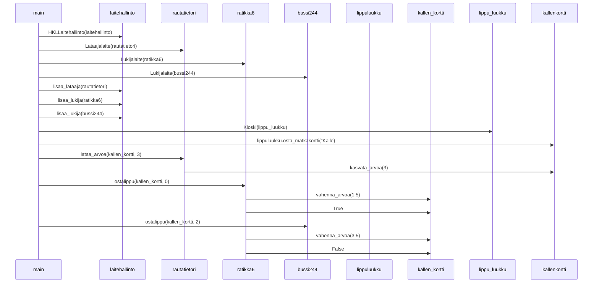

```mermaid
sequenceDiagram
    participant main
    participant laitehallinto
    participant rautatietori
    participant ratikka6
    participant bussi244
    participant lippuluukku
    participant kallen_kortti

    main->>laitehallinto: HKLLaitehallinto(laitehallinto)
    main->>rautatietori: Lataajalaite(rautatietori)
    main->>ratikka6: Lukijalaite(ratikka6)
    main->>bussi244: Lukijalaite(bussi244)

    main->>laitehallinto: lisaa_lataaja(rautatietori)
    main->>laitehallinto: lisaa_lukija(ratikka6)
    main->>laitehallinto: lisaa_lukija(bussi244)

    main->>lippu_luukku: Kioski(lippu_luukku)
    main->>kallenkortti: lippuluukku.osta_matkakortti("Kalle)
    main->>rautatietori: lataa_arvoa(kallen_kortti, 3)
    rautatietori->>kallenkortti: kasvata_arvoa(3)

    main->>ratikka6: ostalippu(kallen_kortti, 0)
    ratikka6->>kallen_kortti: vahenna_arvoa(1.5)
    ratikka6->>kallen_kortti: True

    main->>bussi244: ostalippu(kallen_kortti, 2)
    ratikka6->>kallen_kortti: vahenna_arvoa(3.5)
    ratikka6->>kallen_kortti: False


    


```
