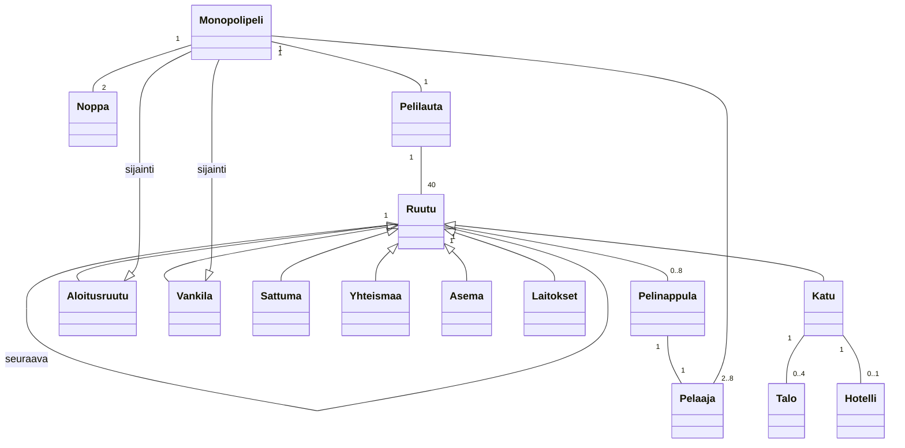

```mermaid
 classDiagram
    Monopolipeli "1" -- "2" Noppa
    Monopolipeli "1" -- "1" Pelilauta
    Pelilauta "1" -- "40" Ruutu
    Ruutu "1" -- "1" Ruutu : seuraava
    Ruutu "1" -- "0..8" Pelinappula
    Ruutu <|-- Aloitusruutu 
    Aloitusruutu <|-- Monopolipeli : sijainti
    Ruutu <|-- Vankila
    Vankila <|-- Monopolipeli : sijainti
    Ruutu <|-- Sattuma
    Ruutu <|-- Yhteismaa
    Ruutu <|-- Asema
    Ruutu <|-- Laitokset
    Ruutu <|-- Katu
    Katu "1" -- "0..4" Talo
    Katu "1" -- "0..1" Hotelli
    Pelinappula "1" -- "1" Pelaaja
    Pelaaja "2..8" -- "1" Monopolipeli
    
```
