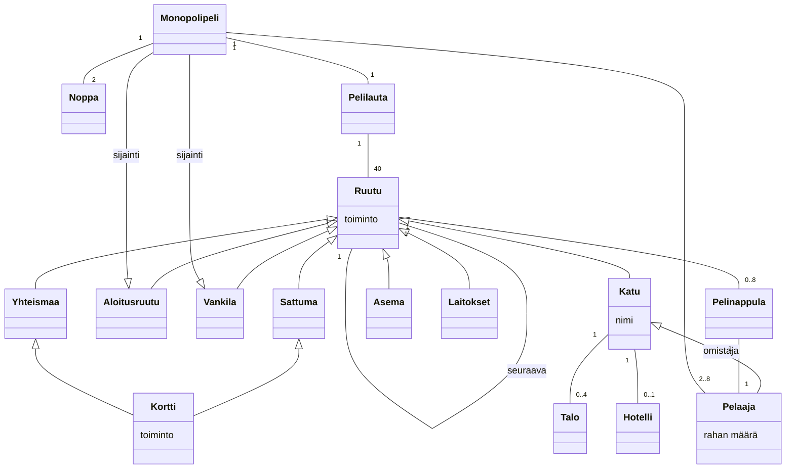

```mermaid
 classDiagram
    Monopolipeli "1" -- "2" Noppa
    Monopolipeli "1" -- "1" Pelilauta
    Pelilauta "1" -- "40" Ruutu
    Ruutu "1" -- "1" Ruutu : seuraava
    Ruutu "1" -- "0..8" Pelinappula
    Ruutu <|-- Aloitusruutu 
    Aloitusruutu <|-- Monopolipeli : sijainti
    Ruutu <|-- Vankila
    Vankila <|-- Monopolipeli : sijainti
    Ruutu <|-- Sattuma
    Sattuma <|-- Kortti
    Ruutu <|-- Yhteismaa
    Yhteismaa <|-- Kortti
    Ruutu <|-- Asema
    Ruutu <|-- Laitokset
    Ruutu <|-- Katu
    Katu "1" -- "0..4" Talo
    Katu "1" -- "0..1" Hotelli
    Katu <|-- Pelaaja : omistaja
    Pelinappula "1" -- "1" Pelaaja
    Pelaaja "2..8" -- "1" Monopolipeli
    class Pelaaja{
        rahan määrä
    }
    class Kortti{
        toiminto
    }
    class Ruutu{
        toiminto
    }
    class Katu{
        nimi
    }
```
