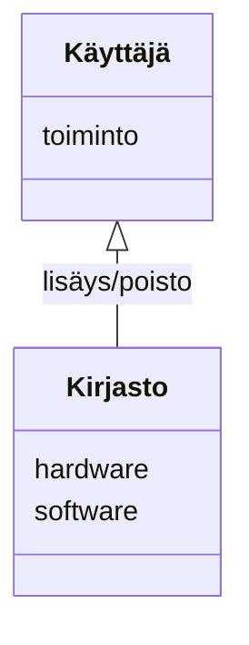

# Arkkitehtuurikuvaus

## Ohjelman rakenne

Ohjelman rakenne pyrkii noudattamaan kerrosarkkitehtuuria jossa ui pakkaus sisältää komponentit käyttöliittymään liittyvän koodin.
Services pakkaus taas pyrkii sisältämään sovelluslogiikan komponentit.
Repositories pakkaus taas huolehtii tiedon pysyväistallennuksesta tietokantaan.
Näiden lisäksi sovelluksesta löytyy ohjelman käsittelemien olioiden User, Hardware ja Software luokat sisältävä Entities pakkaus.

## Ohjelman käyttöliittymä
Ohjelman käyttöliittymä sisältää kolme varsinaista näkymää joista jokainen on toteutettu omana luokkanaan. 
Kirjautumis näkymä aukeaa ohjelman käynnistyessä josta pääsee joko kirjautumalla Kirjasto näkymään tai erillisellä painikkeella aukeavaan rekisteröitymis näkymään.
Kirjasto näkymässä on erilliset ikkunat tuotteiden lisäämiseen ja poistamiseen mutta näiden kaikkien näkymien toiminnasta vastaa LibraryGui luokka.

## Ohjelman sovelluslogiikka
Ohjelman sovelluslogiikka on pyritty eriyttämään käyttäjän User luokan toiminnoista vastaaavan user_servicen ja Hardware ja Software luokkien käsittelystä vastaavan Library_service luokan alle.   

## Ohjelma tietokanta yhteys ja pysyväistallennus

Ohjelman luokat Library_db_manager ja User_db_manager hoitavat sovelluksen pysyväistallennettavan tiedon tallennuksen SQLite tietokantaan.
Varsinaisen tietokantayhteyden ja tietokannan luomisen hoitavatintialize_database, database_connection tiedostot sekä configurointi tiedosto config ja ympäritömuuttujat sisältävä tiedosto .env

## Ohjelma päätoiminnallisuudet

### Käyttäjän rekisteröinti

Luotaessa uusi käyttäjä sovellukseen tallennetaan käyttäjän antama käyttäjänimi ja salasana tietokantaan mikäli tietokannasta ei jo löydy samaa käyttäjänimeä.
Onnistuneen rekisteröinnin jälkeen käyttäjä siirretään takaisin kirjautumis sivulle.

### Kirjautuminen

Kirjautuessa tietokannasta tarkitetaan löytyykö sieltä vastaavuus käyttäjänimelle ja salasanalle. Vastaavuuden löytyessä UserService luokan login luo käyttäjänimestä, salasanasta ja tietokannan user id numerosta User olion joka tyhjennetään uloskirjautumisen tapahtuessa.

### Kirjasto

Kirjastossa käyttäjällä on mahdollisuus luoda Software ja Hardware olioita jotka tallennettaessa liitetään käyttäjään erityisen user_id tiedon kautta joka vastaa User olion ID tietoa.
Tiedot käyttäjän tallentamista Hardware ja Software olioista näkyvät kirjatonäkymässä erillisissä tauluissa.
Tiedon poisto tietokannasta tapahtuu antamalla kyseisen Hardware tai Software olion uniikki ID numero jonka perusteella tieto poistetaan

### Koodin heikkoudet

Erityisesti LibraryGui käyttöliittymässä ja LibraryService sovelluslogiikan toteuttavassa luokassa on päällekkäistä koodia ja toimintoja, jotka olisi mahdollista toteuttaa enemmän sovelluslogiikan puolella

