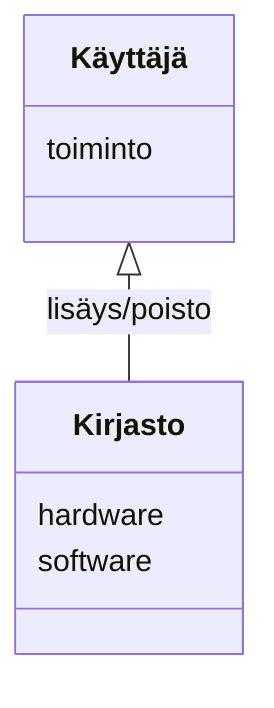

# Arkkitehtuurikuvaus

## Ohjelman rakenne

Ohjelman rakenne pyrkii noudattamaan kerrosarkkitehtuuria jossa ui pakkaus sisältää komponentit käyttöliittymään liittyvän koodin.
Services pakkaus taas pyrkii sisältämään sovelluslogiikan komponentit.
Repositories pakkaus taas huolehtii tiedon pysyväistallennuksesta tietokantaan.
Näiden lisäksi sovelluksesta löytyy ohjelman käsittelemien olioiden User, Hardware ja Software luokat sisältävä Entities pakkaus.

## Ohjelman käyttöliittymä
Ohjelman käyttöliittymä sisältää kolme varsinaista näkymää joista jokainen on toteutettu omana luokkanaan. 
Kirjautumis näkymä aukeaa ohjelman käynnistyessä josta pääsee joko kirjautumalla Kirjasto näkymään tai erillisellä painikkeella aukeavaan rekisteröitymis näkymään.
Kirjasto näkymässä on erilliset ikkunat tuotteiden lisäämiseen ja poistamiseen mutta näiden kaikkien näkymien toiminnasta vastaa LibraryGui luokka.

## Ohjelman sovelluslogiikka
Ohjelman sovelluslogiikka on pyritty eriyttämään käyttäjän User luokan toiminnoista vastaaavan user_servicen ja Hardware ja Software luokkien käsittelystä vastaavan Library_service luokan alle.   

## Ohjelma tietokanta yhteys ja pysyväistallennus

