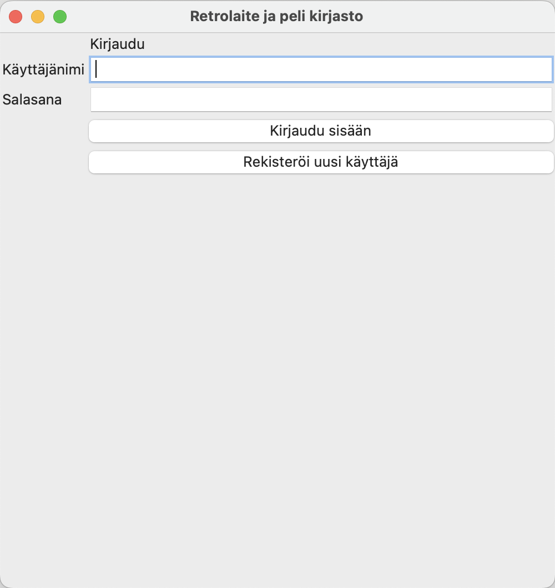
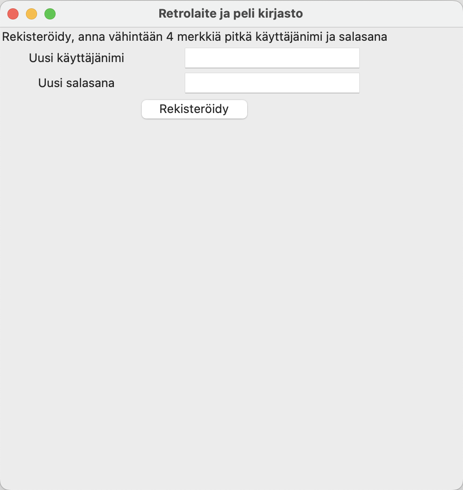
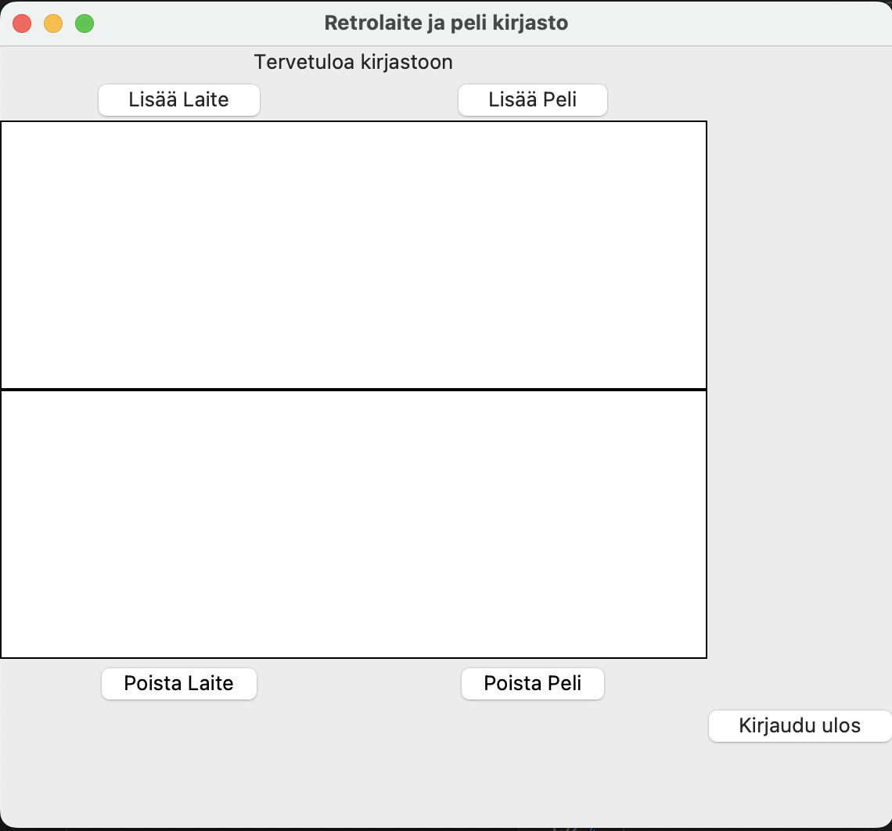
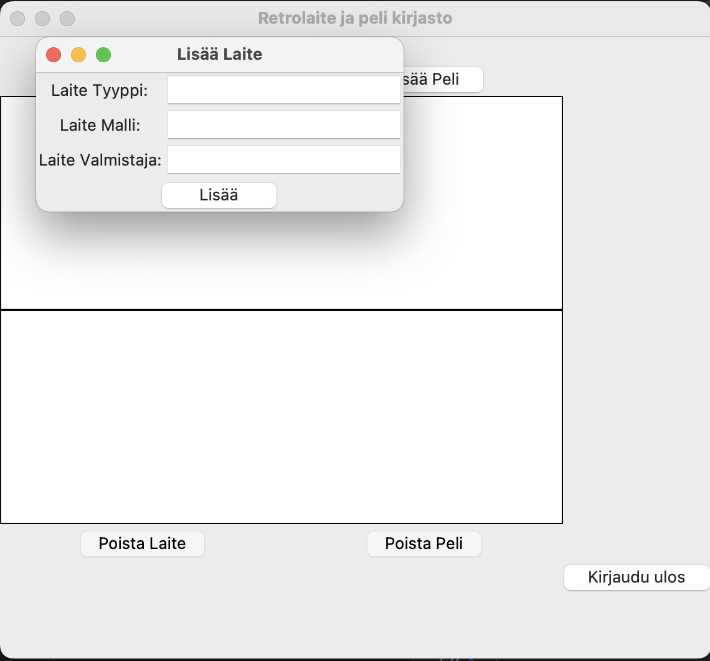
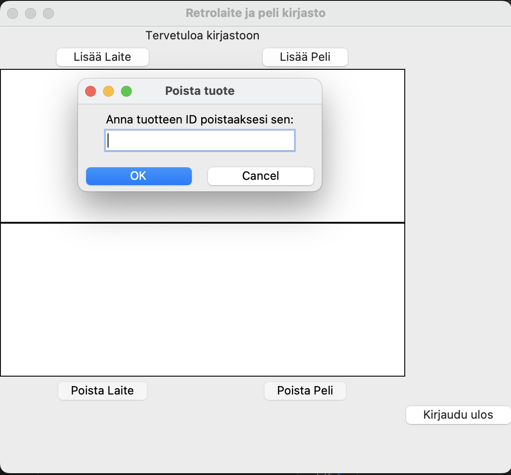

# Käyttöohje


## Sovelluksen käynnistys

1. Riippuvuuksien asennus komennolla:

```bash
poetry install
```

2. Asenna sovelluksen SQLite tietokanta komennolla:

```bash
poetry run invoke build
```

3. Sovelluksen käynnistys komennolla:

```bash
poetry run invoke start
```


## Kirjautuminen ja rekisteröityminen
kirjautumisnäkymä josta pääsee reksteröitymään:



rekisteröitymisnäkymä jossa voit luoda uuden käyttäjän antamalla vähintään 4 merkkiä pitkän käyttäjänimen ja salasanan:



Rekisteröinnin jälkeen palaat vielä kirjautumis näkymään jossa voit kirjautua sisään

## Kirjasto ja tuotteiden lisäys ja poisto

Kirjasto näkymä jossa voit lisätä ja poistaa tuotteita.
Täällä myös näet listattuna laitteet pelit jotka ovat tietokannassa:


Laitteen ja pelien lisäämisen mahdollistavat näkymät:



Ja viimeisenä näkymä jossa on ID numeron perusteella mahdollista poistaa tuote tietokannasta:




