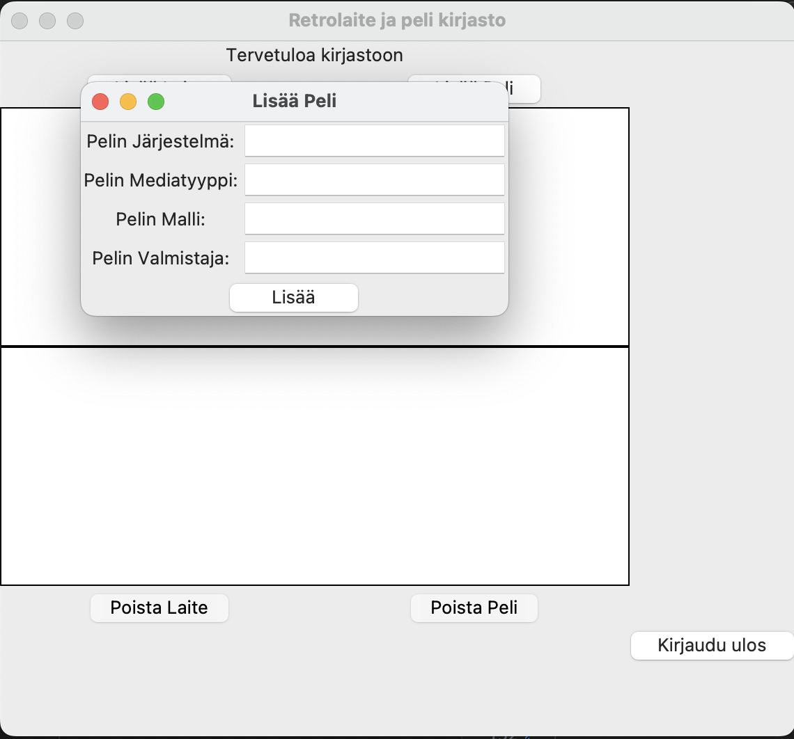

# Käyttöohje


## Sovelluksen käynnistys

1. Riippuvuuksien asennus komennolla:

```bash
poetry install
```

2. Asenna sovelluksen SQLite tietokanta komennolla:

```bash
poetry run invoke build
```

3. Sovelluksen käynnistys komennolla:

```bash
poetry run invoke start
```


## Kirjautuminen ja rekisteröityminen
kirjautumisnäkymä josta pääsee reksteröitymään painamalla "rekisteröi uusi käyttäjä" painiketta:


rekisteröitymisnäkymä jossa voit luoda uuden käyttäjän antamalla vähintään 4 merkkiä pitkän käyttäjänimen ja salasanan:


Rekisteröinnin jälkeen palaat vielä kirjautumisnäkymään, jossa voit kirjautua sisään antamalla rekisteröimäsi käyttäjätunnuksen ja salasanan.
Nyt mikäli olet syöttänyt oikean käyttäjätunnuksen ja salasanan pääset painamalla Kirjaudu sisään painiketta Kirjasto näkymään.

## Kirjasto ja tuotteiden lisäys ja poisto

Kirjasto näkymä jossa voit lisätä ja poistaa tuotteita.
Täällä myös näet listattuna laitteet pelit jotka ovat tietokannassa sinun tunnuksellasi tallennettuna:


Laitteen ja pelien lisäämisen mahdollistavat näkymät, täytä kaikki kentät ja paina "Lisää Laite" tai "Lisää Peli" painiketta:
Lisäämäsi laitteet tulevat näkyviin kirjasto näkymän ylemmässä ikkunassa ja lisäämäsi pelit alemmassa ikkunassa.





Ja viimeisenä näkymä jossa on ID numeron perusteella mahdollista poistaa tuote tietokannasta.
Näkymä tulee esiin painalla "Poista Peli" tai "Poista Laite painiketta.


Näkymän oikeassa alakulmassa olevaa "Kirjaudu ulos" painiketta painalla kirjaudut ulos ja istuntosi päättyy.
Ohjelma palaa tämän jälkeen taas kirjautumisnäkymään.


