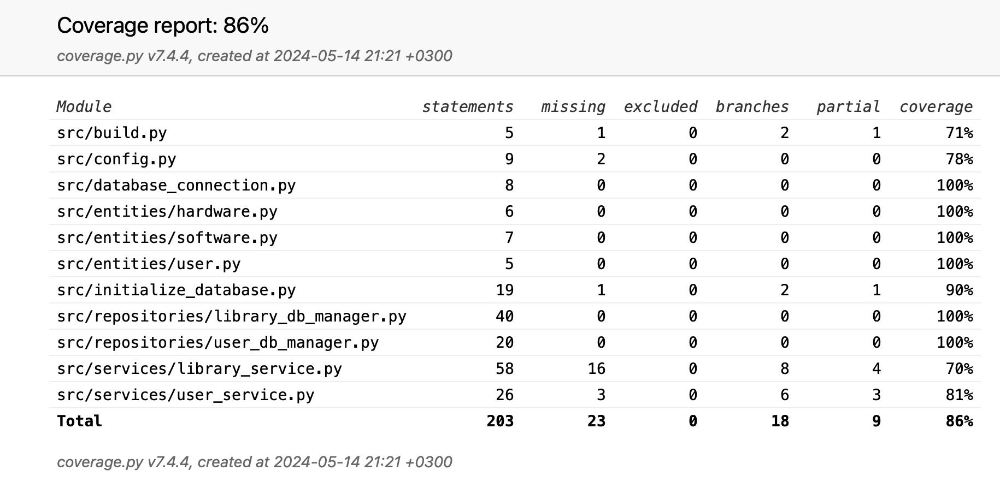

# Testausdokumentti

Ohjelmaa on testtu sovellus logiikan ja tietokanta yhteyden osalta automatisoidusti unittestilla.
Käyttöliittymä testaus on pyritty suorittamaan manuaalisesti läpikäymällä käyttöliittymän komponentteja.

### Sovelluslogiikka
Sovellus logiikan user_service ja library_service luokat on pyritty testaamaan niitä vastaavilla user_service_test ja library_service_test luokilla

### Repositorio-luokat
Pysyväistallennuksesta vastaavien luokkien Library_db_manager ja User_db_manger luokkien testaamisesta vastaavat luokat TestLibrary_db_Manager ja TestUser_db_manger

### Testauskattavuus

Testauksen haaraumakattavuus ilman käyttöliittymä luokkia on 86%

### Järjestelmä testaus

Järjestelmän testaus on suoritettu manuaalisesti käymällä läpi sovelluksen eri toiminnallisuuksia. 
Sovellusta on testattu lisäämällä poistamalla tuotteita eri käyttäjinä kirjautuneena.
Virhetilanteita on pyritty simuloimaan syöttämällä liian lyhyitä arvoja tai jättämällä kenttiä tyhjäksi lomakkeella.
